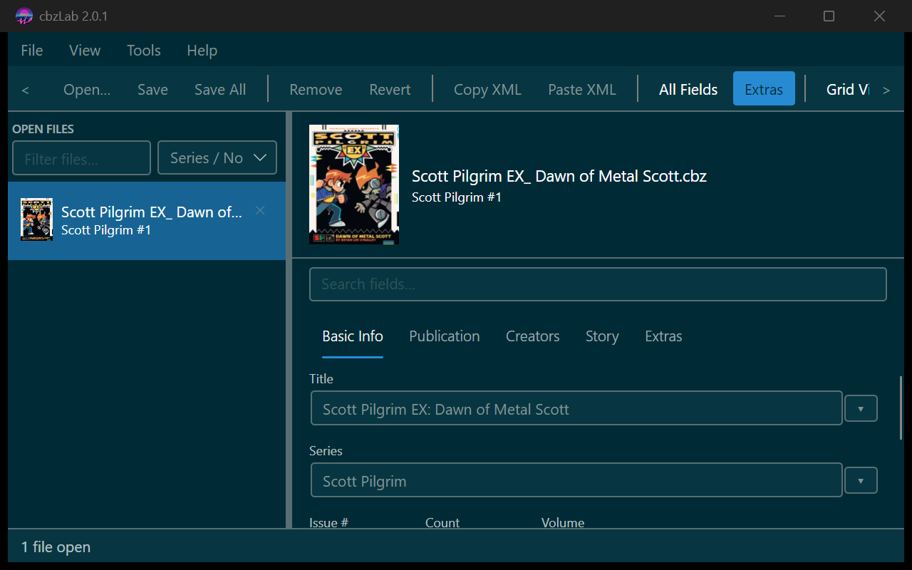
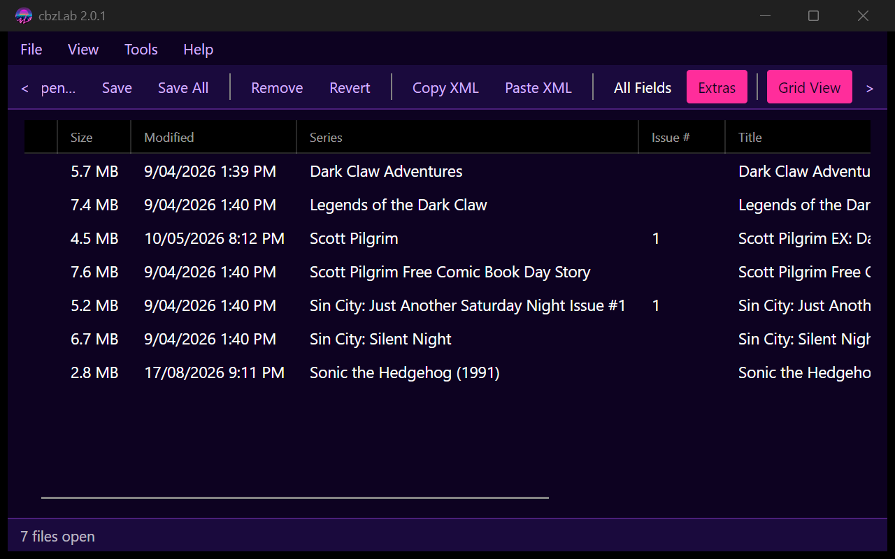

# cbzLab

[](https://github.com/fexofenadine/cbzLab/actions/workflows/build.yml)

**[cbzlab website →](https://fexofenadine.github.io/cbzLab/)** — screenshots, docs and the latest build, all in one place.

A metadata editor for comic book archives. cbzLab opens CBZ and CBR files, lets you
view and edit the `ComicInfo.xml` metadata inside them (single files or whole
batches at once), and writes changes back safely without ever touching the page
images.

Built with C# / .NET 8 and **Avalonia UI**, cross-platform (Windows + Linux + macOS),
deployed as an unpackaged self-contained executable — no installer, no store.

> **Note:** an earlier WinUI 3 / Windows-only version of cbzLab lives under
> `cbzLab.winui3/` and is now archived — see
> [`cbzLab.winui3/ARCHIVED.md`](cbzLab.winui3/ARCHIVED.md). All active development
> is in `cbzLab/` (the Avalonia rewrite — it took over the plain `cbzLab` name once
> it reached parity and the WinUI original moved aside).

<p>
  
  
</p>

More screenshots, across a wider range of the built-in themes, are in the
**[user guide](https://fexofenadine.github.io/cbzLab/guide.html)**.

## Documentation

Also published as a browsable site at **[fexofenadine.github.io/cbzLab](https://fexofenadine.github.io/cbzLab/)**,
rebuilt automatically from these same files whenever they change:

- **[Building from source](https://fexofenadine.github.io/cbzLab/building.html)** —
  environment setup, publishing a distributable executable, and the project layout
  for the current Avalonia app (just the .NET 8 SDK — no Visual Studio or
  platform-specific workload needed), plus a short pointer to building the
  archived WinUI version at the bottom.
- **[User guide](https://fexofenadine.github.io/cbzLab/guide.html)** — opening files,
  the editor, batch editing, grid view, saving, ComicVine lookup, settings and themes.
  The workflow is the same in the Avalonia version; menu/dialog wording matches
  unless noted.
- **[Changelog](https://fexofenadine.github.io/cbzLab/changelog.html)** — version
  history for the current Avalonia app, plus the archived WinUI version's history
  below it.

## Quick start

Grab a [published release](../../releases), or build from source:

```powershell
# Windows
dotnet publish cbzLab\cbzLab.csproj -c Release -r win-x64 --self-contained true

# Linux
dotnet publish cbzLab/cbzLab.csproj -c Release -r linux-x64 --self-contained true
```

Then run the published `cbzLab` executable — nothing needs installing.
