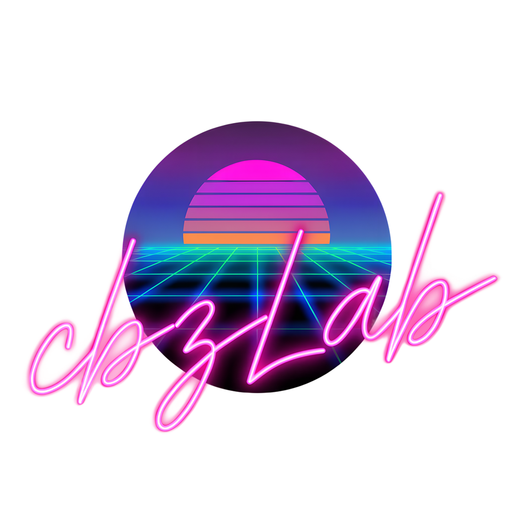

# Building cbzLab from source

cbzLab is a plain SDK-style .NET 8 project — no platform-specific workload,
no Windows-only tooling. If you have the .NET 8 SDK, you can build and run it.

## Prerequisites

Just the **.NET 8 SDK** — <https://dotnet.microsoft.com/download/dotnet/8.0>.
Confirm it's installed with:

```powershell
dotnet --list-sdks
```

You want an `8.0.x` entry. Any editor works: Visual Studio 2022, VS Code (with
the C# Dev Kit extension), JetBrains Rider, or a plain text editor plus the
`dotnet` CLI — none of it is required, just convenient.

## Building and running

```powershell
git clone https://github.com/fexofenadine/cbzLab.git
cd cbzLab
dotnet build cbzLab.sln
dotnet run --project cbzLab/cbzLab.csproj
```

NuGet packages restore automatically on first build.

## Running the tests

```powershell
dotnet test cbzLab.Tests/cbzLab.Tests.csproj
```

29 xUnit tests cover the pure/injectable logic — `DateFieldHelper`,
`ComicInfoXml`, `JsonFileStore`, `AutosaveService`. `SettingsService`,
`SchemaService`, and `ValidationService` aren't tested directly: all three
resolve to the real, shared `%APPDATA%\cbzLab` directory with no injectable
override today, so constructing them for real in a test would risk touching
your actual settings/schema/logs.

## Building a distributable executable

Debug builds (`dotnet build`) are fine for development. For a self-contained,
single-file build you can copy to another machine, publish for the target
platform:

```powershell
# Windows
dotnet publish cbzLab/cbzLab.csproj -c Release -r win-x64 --self-contained true

# Linux
dotnet publish cbzLab/cbzLab.csproj -c Release -r linux-x64 --self-contained true
```

These are exactly the commands the project's own release workflow
(`.github/workflows/release.yml`) runs for each platform, so a passing publish
here means the same thing a real release build does.

Without an explicit `-o`, the output lands in
`cbzLab/bin/Release/net8.0/<rid>/publish/`. Managed dependencies (including
Avalonia's Skia/HarfBuzz native libraries) are collapsed into the single
`cbzLab`/`cbzLab.exe` via `PublishSingleFile` — nothing else needs installing
on the target machine. On Linux, mark the output executable before running it:

```bash
chmod +x cbzLab/bin/Release/net8.0/linux-x64/publish/cbzLab
```

To land the exe somewhere more convenient, add `-o <path>`, e.g.
`-o publish/win-x64`.

**No macOS build.** Avalonia itself targets macOS fine (`-r osx-x64`/
`-r osx-arm64` both work if you want to build it yourself), but the project
doesn't publish or ship one — nobody working on it has Apple hardware to
verify an unsigned, unnotarized build actually runs, and shipping one nobody
can test isn't worth the CI time.

## Dependencies

| Package | Version | Used for |
|---|---|---|
| `Avalonia` / `Avalonia.Desktop` / `Avalonia.Themes.Fluent` | 12.1.1 | the UI framework itself, desktop windowing, and the Fluent theme (default light/dark chrome — cbzLab's own themes layer on top via `ThemeService`) |
| `Avalonia.Controls.DataGrid` | 12.1.2 | grid view's table control — needs its own `StyleInclude` in `App.axaml`, since `FluentTheme` alone doesn't style it |
| `SharpCompress` | 0.50.4 | reading `.cbr`/RAR archives (`ArchiveService`) |

`Avalonia.Diagnostics` (the F12 dev-time inspector) is deliberately not
referenced — as of this writing it has no 12.x release compatible with the
12.1.1 core packages.

## Project layout

```
cbzLab/
  cbzLab.csproj          project config: net8.0, WinExe, self-contained + single-file on Release
  Program.cs              entry point, AppBuilder setup
  App.axaml / .cs         application-level styles, service construction order
  MainWindow.axaml / .cs  the whole main UI: file list, editor, grid view, menu, toolbar
  Assets/                 icon, logo, bundled schema.json/themes.json (seeded to %APPDATA% on first run)
  Assets/themes/          custom theme JSON files bundled with the app (Synthwave Dark, etc.)
  Services/               settings, schema, themes, xml, archives, validation, ComicVine, autosave, updates
  ViewModels/              main/file/field view models — data flow, dirty tracking, composite fields
  Models/                  settings, schema, and ComicVine data classes
  Dialogs/                 one Window (.axaml + .cs) per dialog — Avalonia has no ContentDialog equivalent,
                           so each dialog is its own Window shown via ShowDialog, not a shared static-method file
  Converters/              FieldTemplateSelector (widget dispatch) and FieldValueConverter (grid cell values)
cbzLab.Tests/              xUnit tests for the pure/injectable services and helpers
```

A few things worth knowing before changing this code:

- Archive writes always go temp-file-then-atomic-replace (`ArchiveService`).
  Don't "optimise" that away.
- `ThemeService` mutates a fixed set of shared `SolidColorBrush` instances
  registered into `Application.Resources` as `Th*` keys. Any
  `DynamicResource`-bound control repaints automatically when a brush's
  `.Color` changes — no dictionary replace needed. Adding a themed control
  usually just means binding to an existing `Th*` brush.
- `ComicInfoXml.Build` layers edits on top of the original raw XML bytes so
  complex elements (`<Pages>`) survive untouched. Parsing and writing are
  DTD-disabled — archive contents are untrusted input.
- The five editor tabs are filters over one shared field list. Tab assignment
  is `SchemaService`'s tab map; unknown fields land on Extras.
- `FieldTemplateSelector` dispatches in a specific order — `MonthCompanion is
  not null` (date fields) → `RowCompanions.Count > 0` (numeric row-sharing,
  e.g. Issue #/Count/Volume) → the normal widget-type switch (entry/text/
  combo). Follow this same order for any new composite field, or it'll fall
  through to the wrong template.

## Building the archived WinUI 3 version

The original Windows-only WinUI 3 version is no longer developed, but its
source is kept at `cbzLab.winui3/` for history — see
[`cbzLab.winui3/ARCHIVED.md`](../cbzLab.winui3/ARCHIVED.md). It needs Visual
Studio 2022 with the WinUI application development workload (or .NET desktop
development + the Windows App SDK C# templates and a Windows 11 SDK), and is
no longer part of `cbzLab.sln` — open `cbzLab.winui3/cbzLab.csproj` directly.
Publish with:

```powershell
dotnet publish cbzLab.winui3/cbzLab.csproj -c Release -r win-x64 --self-contained true
```

Output lands in
`cbzLab.winui3/bin/x64/Release/net8.0-windows10.0.19041.0/win-x64/publish/`,
alongside a handful of native Windows App SDK files
(`Microsoft.ui.xaml.dll`, `DWriteCore.dll`, the WindowsAppRuntime bootstrapper,
`resources.pri`) that the OS loads directly and can't be folded into the exe —
true of any unpackaged WinUI 3 app, not specific to this project.
