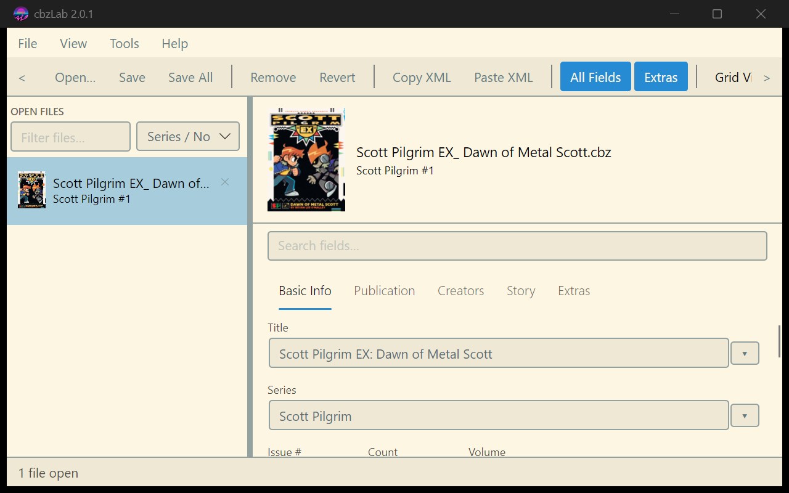
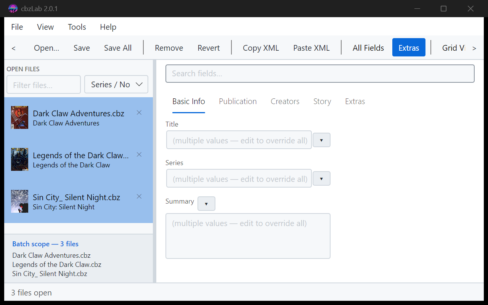
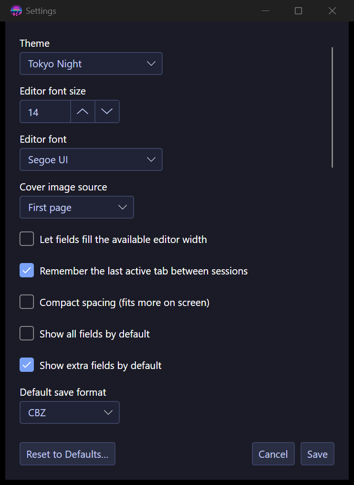

# Using cbzLab

> Describes **cbzLab**, the current Avalonia app (`cbzLab/`). The workflow below
> also matches the archived WinUI 3 version (`cbzLab.winui3/`, see
> [`cbzLab.winui3/ARCHIVED.md`](../cbzLab.winui3/ARCHIVED.md)) menu-for-menu,
> unless noted otherwise elsewhere in this guide.

## Opening files

- **File → Open** (Ctrl+O), the toolbar button, or pass paths on the command line:
  `cbzLab.exe "C:\comics\Batman 001.cbz" "C:\comics\Batman 002.cbz"`.
- CBZ/ZIP and CBR/RAR are both supported for reading. Mislabelled files (a RAR
  renamed to .cbz, say) are detected by content, not extension.
- Recently opened files live under **File → Open Recent**.
- You can also drag cbz/cbr files from Explorer straight onto the window to open them.

## The editor

- Open files appear in the left sidebar with a small cover thumbnail (taken
  from the first image in the archive), the filename, and a derived subtitle
  (series/number/volume). A coloured dot marks unsaved changes.
- Above the file list, a **Filter files…** box narrows the sidebar by filename
  or subtitle — this is separate from the field search box lower down, which
  only searches fields within the file(s) currently open in the editor.
- The sort dropdown next to it offers **Name**, **Series / No.**, and
  **Modified** (unsaved files first). Name and Series/No. sort only update when
  you change the sort mode or the filter — not on every keystroke while you're
  editing a field, so the list doesn't reorder itself under your cursor mid-edit.
  Modified updates live as files become dirty, since that's the whole point of it.
- Selecting a single file shows a larger cover and title banner above the
  search box; it's hidden during batch editing since it wouldn't apply to
  more than one file.
- Metadata fields are grouped into five tabs: **Basic Info**, **Publication**,
  **Creators**, **Story** and **Extras**. The tabs filter one shared form — they're
  views onto the same data, not separate pages.
- By default only fields with values are shown. Toggle **All Fields** (toolbar or
  View menu) to see everything, including empty fields.
- The search box above the tabs filters the current tab's fields by label or value.
- Hover any field label for a tooltip explaining what the field is for.
- Fields not part of the official ComicInfo v2.0 schema that are found in your
  files are registered automatically, appear on the **Extras** tab, and are
  remembered between sessions. The **Extras** toggle shows/hides them.
- Single-line fields (Writer, Publisher, Imprint, and so on) remember what you've
  typed into them before. A small picker button appears beside the field once
  it has any history — click it to pick a recent value instead of retyping.
  Doesn't apply to multi-line fields (Summary, Notes) or dropdown fields (which
  already have their own curated list of options).

## Batch editing

- Select multiple files in the sidebar (Ctrl-click / Shift-click). The editor
  switches to batch mode and a panel appears listing the files in scope.
- Fields where the selected files agree show the common value. Fields that differ
  show a coloured *"(multiple values — edit to override all)"* placeholder.
- Anything you type or pick applies to **every** selected file, immediately marking
  them all dirty. Untouched fields keep their per-file values.
- Dropdown fields in batch mode become a picker listing each distinct value with a
  count of how many files carry it — click one to apply it to the whole selection.
- Search is disabled while in batch mode.
- **Copy Fields to Rest of Selection** (right-click a file within a multi-select):
  copies the right-clicked file's own field values onto every other selected
  file. Only overwrites the fields you tick in the confirmation list — Number
  and Page Count start unticked since they're almost always specific to one
  issue.

## Grid view

The **Grid View** toggle (toolbar, far right) swaps the whole sidebar+editor
layout for a full-width table of your open files — one row per file, one
column per field, useful for spotting which books are missing a field at a
glance. A dot in the leftmost column marks unsaved files, same as the
sidebar. Right-click the grid, or **View → Choose Grid Columns…**, to pick
which fields appear — defaults to Series, Number, Writer, Publisher, listed
in a curated "most likely wanted" order rather than raw schema order; your
choice is remembered either way. The grid is backed by the same file list as
the sidebar, so it already reflects your current sort and filter.

Cells themselves are read-only — editing happens back in the normal view.
**Double-click** any row to jump straight there for that one file, regardless
of anything else you've selected. **Right-click** adapts to your selection:
one file offers "Edit This Book", several offer "Edit N Books in Batch
Editor". Your selection carries across the toggle either way — switching
into grid view seeds it from whatever's selected in the sidebar, switching
back out (via the toolbar toggle, not double/right-click) does the reverse.

If the toolbar is wider than the window, small arrow buttons appear at each
end to scroll it left/right rather than wrapping to a second row.

## Keyboard navigation

- **Ctrl+1** through **Ctrl+5** jump straight to a tab; **Ctrl+Tab** /
  **Ctrl+Shift+Tab** cycle through them.
- **F6** moves keyboard focus to the file list; **Shift+F6** moves it to the
  search box in the editor pane.
- Right-click any single field for **Revert to Saved**, which discards a
  pending edit to just that one field (single-file mode only).

## Saving

- **Save** (Ctrl+S) writes the selected file(s) back in place, same format and path.
- **Save As** (Ctrl+Shift+S) writes a single file to a new path, as CBZ or CBR.
- **Save All** (Ctrl+Alt+S) writes every file with unsaved changes, showing a
  confirmation list with a per-file format selector first.
- Values are validated on save (whole-number fields, Community Rating range and so
  on). Problems are listed with suggested fixes and you can fix or save anyway.
- Numeric fields also validate as you type: an invalid value gets a red outline
  and an inline message straight away, rather than waiting until you save.
- Writes are atomic: the new archive is built as a temporary file and swapped in
  only when complete, so a crash mid-save can't corrupt your comics.
- Page images and any `<Pages>` element in the existing XML are preserved
  byte-for-byte in spirit — only the flat metadata elements are touched.

## CBR (RAR) writing — important

Reading CBR needs nothing extra. **Writing** CBR requires an external tool because
the RAR format can only be created by WinRAR's own `rar.exe`:

- If WinRAR is installed and `rar` is on your PATH (or you set the path in
  Settings), CBR saves work fully — in-place updates and CBZ→CBR conversion.
- 7-Zip (`7z`/`7za`/`7zz`) is accepted as a configured tool but **cannot create
  RAR archives**; attempts will fail with the tool's own error message. Its
  practical use is limited — if you don't have WinRAR, save as CBZ instead
  (arguably the better format anyway).

## Tools

- **Guess from Filename** — parses Series, Number, Volume and Year out of the
  selected file(s)' own filename, falling back to the parent folder name for
  Series when the filename alone doesn't have enough to go on. Only fills
  fields that are currently empty; never overwrites anything you've already
  set. Works across a whole batch selection, since each file's own path is
  used independently.
- **Auto Page Count** — counts image files in the current archive and writes the
  result to the Page Count field. Also runs automatically on open (fills the field
  only when it's empty; configurable in Settings).
- **Copy XML** — puts the current file's ComicInfo.xml (with your pending edits)
  on the clipboard.
- **Paste XML** — replaces the current file's metadata from ComicInfo XML on the
  clipboard. Handy for cloning metadata between files.

## Settings, themes and storage

**Tools → Settings** covers theme, editor font size and font, default field
visibility, default save format, batch-save confirmation, auto page count,
recent-files length, the RAR tool path, whether the first opened file is
auto-selected, whether the sidebar filter clears when new files are opened,
when live field validation runs (as you type / when you leave the field /
off), how many recently typed values are remembered per field, which page of
the archive becomes the cover thumbnail (first or last), whether fields fill
the available editor width or stay capped at a fixed width, whether the last
active tab is remembered between sessions, and a compact spacing option that
fits more on screen.

A **Reset to Defaults** button in the same dialog resets all of the above
back to their defaults (confirmed first, since it includes your ComicVine
API key). It only touches your preferences — auto-discovered unofficial
fields, recently typed values, and cached ComicVine lookups are separate
accumulated data and aren't affected.

**Online metadata lookup (ComicVine)** — off by default, near the bottom of
Settings. Turning it on reveals an API key field (get a free one at
comicvine.gamespot.com/api), a Test Connection button to check the key works,
and an "always review matches before applying" option — and adds a **Search
ComicVine** action (Tools menu and toolbar) that's otherwise not present
anywhere in the app at all.

Search ComicVine looks up a single selected file's series (using its own
Series field if set, or a filename/folder guess otherwise), then helps you
find the matching issue — confirming an auto-match rather than applying it
silently, since issue-number matching can be genuinely ambiguous (variant
covers, facsimile editions, reprints). A series you've already matched is
remembered, so tagging several issues from the same run only needs one real
search. Once an issue is confirmed, a review dialog shows only the fields
where ComicVine's data actually differs from what's already in the file —
current value and proposed value shown side by side — so you can judge each
one before it's applied. Nothing is written unless you tick it and confirm.

Selecting **multiple files** and running Search ComicVine does one series
search for the whole batch, then matches each file to its own issue
individually — every file always gets its own matched data, never one
file's values forced onto the rest. The review step covers every matched
file at once: a field where every file's match agrees (Writer, Publisher,
Characters, and similar series-level facts) shows as a single line and is
ticked by default; a field that actually differs across the matched files
is flagged and left unticked, listing every distinct value and how many
files carry it, since that's exactly the situation worth a second look
before applying — it might be a genuine change partway through the run, or
it might be a mismatch. Fields that are naturally expected to vary issue to
issue (Number, Title, dates, Summary) aren't held to that comparison at
all. Any file that can't be matched is skipped and named at the end so it
can be re-run on its own.

Two more preferences are remembered automatically, without a Settings control,
since they're already directly adjustable in the main window itself: the sidebar
sort mode (the dropdown above the file list) and the window's size and position.

Everything lives in `%APPDATA%\cbzLab`:

| File / folder            | Purpose                                              |
|--------------------------|------------------------------------------------------|
| `cbzLab_settings.json`   | preferences and recent files                         |
| `schema.json`            | field definitions — editable, seeded on first run    |
| `schema_extra.json`      | auto-registered unofficial fields                    |
| `recent_values.json`     | recently typed values per field, for the picker      |
| `comicvine_cache.json`   | cached ComicVine lookups (foundation only for now — see below) |
| `themes.json`            | built-in theme definitions — editable                |
| `themes\*.json`          | custom themes, one file per theme                    |
| `logs\cbzLab-yyyyMMdd.log` | one plain-text log file per day (Settings → Open logs folder) |

To make your own theme, copy one of the files in `themes\` (e.g.
`Synthwave Dark.json`), rename it — the filename becomes the theme name — and
change the colour values. Keys you omit fall back to Solarized Dark. Themes are
picked up at launch and apply instantly when selected, no restart needed. Keys
beginning with `_` are treated as comments.
